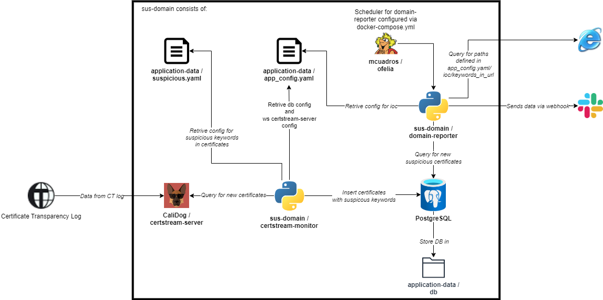
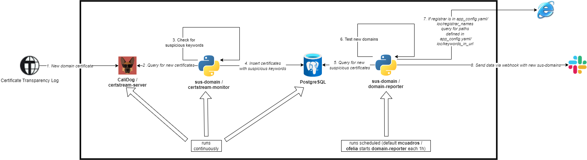

set of docker images which are prepared for monitoring new certificates and alerting when registered domains seems suspicious.

TLDR:
```
1. modify ./application-data/configs/app_config.yaml
2. modify ./application-data/configs/suspicous.yaml
3. mkdir ./application-data/db

4. docker compose up -d
```

domain monitor cosist of:

- certstream server - https://github.com/CaliDog/certstream-server
- certstream monitor - service writen in python which consumes events from certstream and adds it to postgresql
- domain-reporter - python script which consumes events from rabbitmq and reports via slack to channel certstream-poc
- postgresql - for storing suspicous domain data
- ofelia - for scheduling domain-reporter

ENVS for configuring service, all envs have SEC_CST preffix, if there's no env provided configuration will be fetched from `./application-data/configs/app_config.yaml`:

Envs for configuring certstream-monitor:
- SEC_CST_CERTSTREAM_URL
- SEC_CST_SCORE_LOG
- SEC_CST_SCORE_STDOUT
- SEC_CST_SCORE_REPORT

Envs for configuring postgresql:
- SEC_CST_DB_HOST
- SEC_CST_DB_USERNAME
- SEC_CST_DB_PASSWORD
- SEC_CST_DB_NAME

Env for configuring webhook on slack:
- SEC_CST_SLACK_URL

Env for setting log level:
- SEC_CST_LOG_LEVEL




